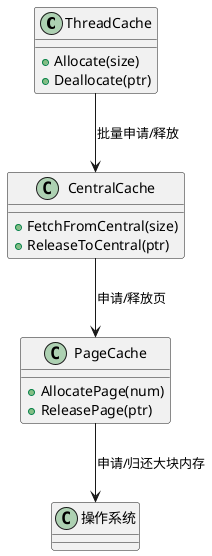
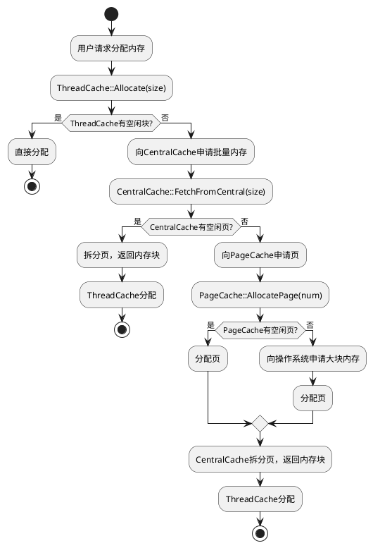

# MemoryPool

MemoryPool 是一个高性能 C++ 内存池项目，旨在高效管理频繁的小对象分配与回收，支持多线程环境，参考了 TCMalloc、jemalloc 等主流分配器的设计思想。项目分为多个版本（v1、v2），逐步优化内存管理策略和并发性能。

---

## 目录结构

```
memorypool/
├── v1/                # 第一版内存池实现（基础单线程）
│   ├── include/       # 头文件
│   ├── src/           # 源码
│   └── test/          # 单元测试
├── v2/                # 第二版内存池（分层设计，支持多线程）
│   ├── include/       # 头文件（CentralCache、PageCache、ThreadCache等）
│   ├── src/           # 源码
│   ├── test/          # 测试
│   └── uml/           # UML/流程图
└── build/             # 构建输出
```

---

## 设计与实现

### v1 版本

基础内存池实现，适合单线程环境，主要关注内存碎片管理和分配效率。

### v2 版本（推荐）

采用分层设计，支持多线程高并发，主要模块如下：

- **ThreadCache**：线程本地缓存，负责小对象的分配和释放，极大减少锁竞争。
- **CentralCache**：中央缓存，多个线程共享，负责批量分配和回收，协调 ThreadCache 与 PageCache。
- **PageCache**：页缓存，负责大块内存（页）的分配和回收，向操作系统申请或归还内存。
- **Common**：公共类型、常量、工具函数等。

#### 主要类关系



#### 内存分配流程



---

## 详细模块说明

### ThreadCache

- 每个线程独立拥有，避免多线程竞争。
- 维护多个自由链表（按对象大小分类）。
- 支持批量向 CentralCache 申请/归还内存块。

### CentralCache

- 负责多个 ThreadCache 之间的内存协调。
- 维护不同大小的 Span 列表。
- 支持批量分配、回收，减少锁粒度。

### PageCache

- 管理大块内存（页），向操作系统申请/归还。
- 维护空闲页链表，支持页的拆分与合并。

### Common

- 包含常用类型定义、对齐工具、常量等。

---

## 使用示例

以 v2 版本为例：

```cpp
#include "memorypool.h"

int main() {
	void* p = MemoryPool::Instance().Allocate(64); // 分配64字节
	// ... 使用内存 ...
	MemoryPool::Instance().Deallocate(p, 64);      // 释放内存
	return 0;
}
```

---

## 构建与测试

### 构建

```bash
cd v2
mkdir build && cd build
cmake ..
make
```

### 运行测试

```bash
# 假设 test 目录下有测试用例
./memorypool_v1_test
```

---

## 性能与适用场景

- 频繁小对象分配/释放
- 多线程高并发内存管理
- 性能敏感型服务端/游戏/网络应用

---

## 参考与致谢

- [TCMalloc](https://github.com/google/tcmalloc)
- [jemalloc](https://github.com/jemalloc/jemalloc)

---

如需详细设计说明或 API 文档，请查阅 `include/` 目录下头文件或 `uml/` 目录下的流程图。
